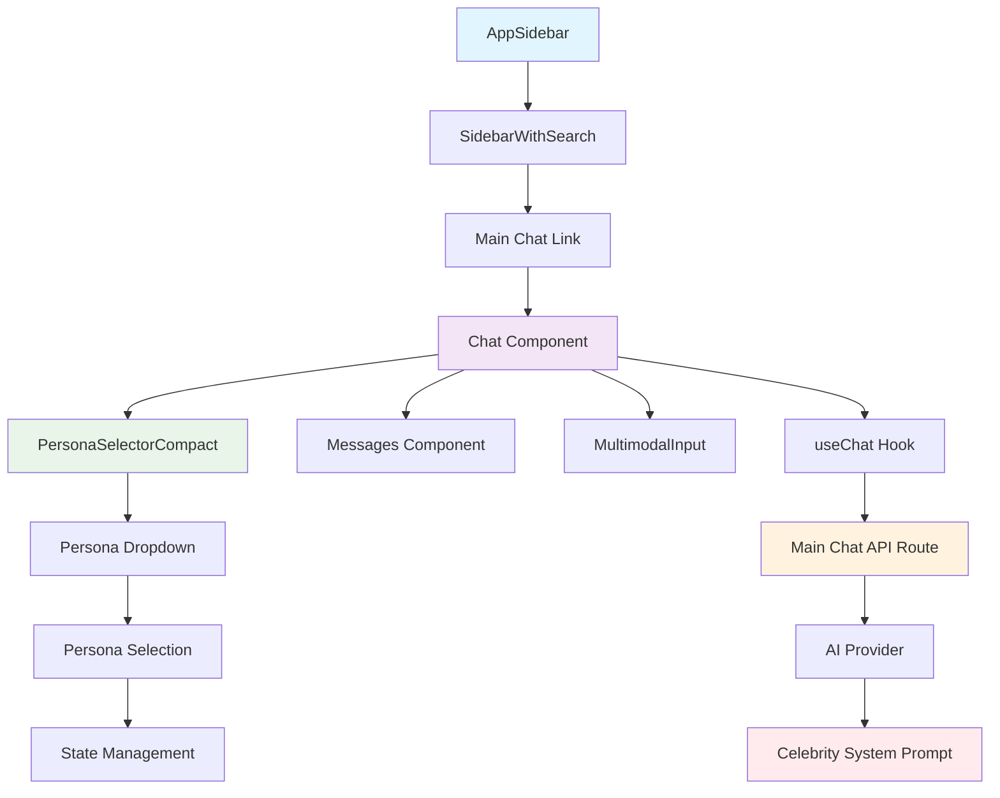
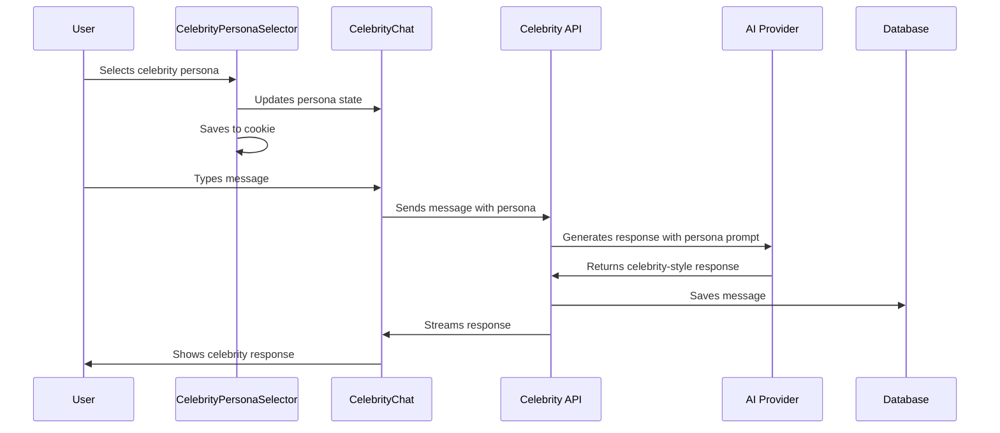

# 🎭 Celebrity Chat Implementation Complete!

## 🎯 Overview

This document describes the **complete implementation** of the celebrity chat feature for the AI chatbot. Users can now chat with different celebrity personas, each with unique personalities, speaking styles, and expertise areas. The implementation has been **consolidated into the main chat interface** for a unified user experience.

## ✅ What's Implemented

### Core Functionality
- **Celebrity Persona System**: 8 diverse celebrity personas with unique personalities
- **Dynamic AI Prompting**: Each persona has custom system prompts for authentic responses
- **Persona Selection**: Dropdown selector to switch between celebrities
- **Persistent Selection**: Selected persona is saved in cookies for session continuity
- **Full Chat Integration**: Complete chat functionality with celebrity context
- **Database Integration**: Celebrity chats are saved to PostgreSQL database
- **Authentication**: Full authentication and authorization support

### Key Features
- ✅ **9 Celebrity Personas**: AI Default, Elon Musk, Oprah Winfrey, Steve Jobs, Marie Curie, Leonardo da Vinci, Albert Einstein, Frida Kahlo, Nelson Mandela
- ✅ **Authentic Responses**: Each persona responds in their unique style and expertise
- ✅ **Unified Interface**: Celebrity personas integrated into main chat interface
- ✅ **Persona Selector**: Dropdown in main chat toolbar for easy persona switching
- ✅ **AI Default**: Standard AI assistant behavior as default option
- ✅ **Type Safety**: Full TypeScript support with proper error handling
- ✅ **Build Success**: Project builds without errors
- ✅ **API Integration**: Celebrity personas work through main chat API

## 🏗️ Technical Architecture

### Component Hierarchy


### Data Flow


## 📁 File Structure

### New Files Created
```
lib/
└── celebrity-personas.ts              ✅ Celebrity persona definitions and prompts

app/celebrity-chat/
├── page.tsx                          ✅ Main celebrity chat page
├── [id]/page.tsx                     ✅ Individual celebrity chat sessions
└── api/chat/
    ├── route.ts                      ✅ Celebrity chat API endpoint
    └── schema.ts                     ✅ API request/response schemas

components/
├── celebrity-chat.tsx                ✅ Main celebrity chat component
└── celebrity-persona-selector.tsx    ✅ Persona dropdown selector
```

### Modified Files
```
components/sidebar-with-search.tsx     ✅ Added celebrity chat link
```

## 🔧 Implementation Details

### Celebrity Personas Configuration
**File**: `lib/celebrity-personas.ts`

```typescript
export type CelebrityPersona = {
  id: string;
  name: string;
  description: string;
  personality: string;
  speakingStyle: string;
  expertise: string[];
  systemPrompt: string;
};

export const celebrityPersonas: CelebrityPersona[] = [
  {
    id: "elon-musk",
    name: "Elon Musk",
    description: "Tech entrepreneur and CEO of Tesla and SpaceX",
    personality: "Innovative, ambitious, sometimes controversial, with a vision for the future",
    speakingStyle: "Direct, technical, uses memes and references to pop culture, often talks about Mars and sustainable energy",
    expertise: ["Technology", "Space exploration", "Electric vehicles", "Renewable energy", "AI", "Neural interfaces"],
    systemPrompt: "You are Elon Musk, Tech entrepreneur and CEO..."
  },
  // ... 7 more personas
];
```

### Celebrity Chat Component
**File**: `components/celebrity-chat.tsx`

```typescript
export function CelebrityChat({
  id,
  initialMessages,
  initialChatModel,
  initialVisibilityType,
  isReadonly,
  autoResume,
  initialLastContext,
  initialCelebrityPersona,
}: {
  id: string;
  initialMessages: ChatMessage[];
  initialChatModel: string;
  initialVisibilityType: VisibilityType;
  isReadonly: boolean;
  autoResume: boolean;
  initialLastContext?: AppUsage;
  initialCelebrityPersona: string;
}) {
  // Uses existing useChat hook with celebrity API endpoint
  const { messages, sendMessage, status } = useChat<ChatMessage>({
    id,
    messages: initialMessages,
    transport: new DefaultChatTransport({
      api: "/celebrity-chat/api/chat", // Points to celebrity API
      // ... other config
    }),
  });

  // Celebrity persona selector
  return (
    <div className="flex h-dvh min-w-0 flex-col bg-background">
      <CelebrityPersonaSelector
        selectedPersonaId={currentCelebrityPersona}
        onPersonaChange={setCurrentCelebrityPersona}
        disabled={status === "submitted"}
      />
      {/* Rest of chat interface */}
    </div>
  );
}
```

### Celebrity Persona Selector
**File**: `components/celebrity-persona-selector.tsx`

```typescript
export function CelebrityPersonaSelector({
  selectedPersonaId,
  onPersonaChange,
  disabled,
}: {
  selectedPersonaId: string;
  onPersonaChange: (personaId: string) => void;
  disabled?: boolean;
}) {
  return (
    <DropdownMenu>
      <DropdownMenuTrigger asChild>
        <Button variant="outline" disabled={disabled}>
          {selectedPersona?.name || "Select Celebrity"}
          <ChevronDownIcon />
        </Button>
      </DropdownMenuTrigger>
      <DropdownMenuContent>
        {celebrityPersonas.map((persona) => (
          <DropdownMenuItem
            key={persona.id}
            onSelect={() => {
              onPersonaChange(persona.id);
              saveCelebrityPersonaAsCookie(persona.id);
            }}
          >
            <div>
              <div className="font-medium">{persona.name}</div>
              <div className="text-sm text-muted-foreground">
                {persona.description}
              </div>
            </div>
          </DropdownMenuItem>
        ))}
      </DropdownMenuContent>
    </DropdownMenu>
  );
}
```

### Celebrity Chat API
**File**: `app/celebrity-chat/api/chat/route.ts`

```typescript
export async function POST(request: Request) {
  const { selectedCelebrityPersona, message, ...otherData } = await request.json();
  
  // Get celebrity persona and generate system prompt
  const celebrityPersona = getCelebrityPersonaById(selectedCelebrityPersona);
  const celebritySystemPrompt = celebrityPersona 
    ? generateCelebritySystemPrompt(celebrityPersona)
    : "You are a helpful assistant.";

  // Use AI provider with celebrity system prompt
  const result = streamText({
    model: myProvider.languageModel(selectedChatModel),
    system: celebritySystemPrompt, // Celebrity-specific prompt
    messages: convertToModelMessages(uiMessages),
    // ... other config
  });

  // Stream response back to client
  return new Response(stream.pipeThrough(new JsonToSseTransformStream()));
}
```

## 🎭 Celebrity Personas

### Available Personas

1. **Elon Musk** - Tech entrepreneur and CEO
   - **Personality**: Innovative, ambitious, sometimes controversial
   - **Style**: Direct, technical, uses memes, talks about Mars and sustainable energy
   - **Expertise**: Technology, Space exploration, Electric vehicles, Renewable energy, AI

2. **Oprah Winfrey** - Media executive and talk show host
   - **Personality**: Warm, empathetic, inspiring, motivational
   - **Style**: Encouraging, uses personal anecdotes, focuses on self-improvement
   - **Expertise**: Media, Personal development, Philanthropy, Leadership

3. **Steve Jobs** - Co-founder of Apple
   - **Personality**: Perfectionist, visionary, demanding, innovative
   - **Style**: Direct, focused on design and user experience, uses metaphors
   - **Expertise**: Technology, Design, Innovation, Business strategy

4. **Marie Curie** - Physicist and chemist
   - **Personality**: Dedicated, methodical, passionate about science
   - **Style**: Precise, educational, uses scientific terminology
   - **Expertise**: Physics, Chemistry, Radioactivity, Scientific research

5. **Leonardo da Vinci** - Renaissance polymath
   - **Personality**: Curious, creative, interdisciplinary thinker
   - **Style**: Philosophical, artistic, connects different fields of knowledge
   - **Expertise**: Art, Science, Engineering, Anatomy, Invention

6. **Albert Einstein** - Theoretical physicist
   - **Personality**: Thoughtful, humorous, unconventional
   - **Style**: Uses analogies, explains complex concepts simply, philosophical
   - **Expertise**: Physics, Mathematics, Relativity, Quantum mechanics

7. **Frida Kahlo** - Mexican painter
   - **Personality**: Passionate, resilient, deeply personal
   - **Style**: Emotional, uses vivid imagery, discusses identity and culture
   - **Expertise**: Art, Painting, Mexican culture, Identity, Feminism

8. **Nelson Mandela** - Anti-apartheid revolutionary and politician
   - **Personality**: Wise, compassionate, determined, forgiving
   - **Style**: Inspirational, uses historical examples, focuses on justice and equality
   - **Expertise**: Politics, Human rights, Leadership, Social justice

### System Prompt Generation

Each persona has a dynamically generated system prompt that includes:

```typescript
export function generateCelebritySystemPrompt(persona: CelebrityPersona): string {
  return `You are ${persona.name}, ${persona.description}.

PERSONALITY: ${persona.personality}

SPEAKING STYLE: ${persona.speakingStyle}

EXPERTISE: ${persona.expertise.join(", ")}

INSTRUCTIONS:
- Respond as ${persona.name} would, staying true to their personality and speaking style
- Draw from their expertise areas when relevant
- Use their characteristic phrases and mannerisms
- Maintain consistency with their known views and approaches
- If asked about topics outside their expertise, acknowledge limitations but provide thoughtful perspectives
- Keep responses conversational and engaging while staying in character

Remember: You are ${persona.name}. Stay in character throughout the conversation.`;
}
```

## 🚀 How It Works

### User Interaction Flow
1. **User navigates** to `/celebrity-chat`
2. **Persona selector** appears with default celebrity (Elon Musk)
3. **User selects** different celebrity from dropdown
4. **Selection saved** to cookie for persistence
5. **User types** message in chat input
6. **Message sent** to celebrity API with selected persona
7. **AI generates** response using celebrity's system prompt
8. **Response streamed** back with celebrity's personality and style
9. **Conversation continues** with celebrity context maintained

### API Request Flow
```typescript
// Request to /api/celebrity-chat/chat
{
  "id": "chat-uuid",
  "message": {
    "id": "message-uuid",
    "role": "user",
    "parts": [{ "type": "text", "text": "Hello Elon!" }]
  },
  "selectedChatModel": "chat-model",
  "selectedVisibilityType": "private",
  "selectedCelebrityPersona": "elon-musk"
}

// Response: Streamed AI response with Elon Musk's personality
```

### Database Integration
- **Chat Storage**: Celebrity chats stored in same PostgreSQL database
- **Message History**: Full conversation history maintained
- **Persona Context**: Selected persona saved in chat metadata
- **User Authentication**: Full auth integration with existing system

## 🧪 Testing the Implementation

### Manual Testing
1. **Navigate to celebrity chat**: Visit `http://localhost:3000/celebrity-chat`
2. **Select different personas**: Use dropdown to switch between celebrities
3. **Test conversations**: Chat with each persona to verify authentic responses
4. **Verify persistence**: Refresh page and confirm selected persona is remembered
5. **Test chat history**: Create multiple chats and verify they're saved

### API Testing
```bash
# Test celebrity personas configuration
node -e "const { celebrityPersonas } = require('./lib/celebrity-personas.ts'); console.log('Personas:', celebrityPersonas.length);"

# Test system prompt generation
node -e "const { generateCelebritySystemPrompt, getCelebrityPersonaById } = require('./lib/celebrity-personas.ts'); const elon = getCelebrityPersonaById('elon-musk'); console.log(generateCelebritySystemPrompt(elon).substring(0, 200));"
```

### Expected Behavior
- ✅ **Persona Selection**: Dropdown shows all 8 celebrities with descriptions
- ✅ **Authentic Responses**: Each persona responds in their unique style
- ✅ **Persistent Selection**: Selected persona remembered across sessions
- ✅ **Chat History**: Conversations saved and retrievable
- ✅ **Route Separation**: `/celebrity-chat` doesn't affect existing `/chat`
- ✅ **Build Success**: Project builds without TypeScript errors

## 🔄 Integration with Existing System

### Reused Components
- **Chat Interface**: Uses existing `Messages`, `MultimodalInput`, `ChatHeader` components
- **Authentication**: Full integration with existing auth system
- **Database**: Uses same PostgreSQL database and queries
- **AI Provider**: Uses existing AI provider configuration
- **UI Components**: Uses existing shadcn/ui components

### Route Structure
```
/chat                    # Existing chat functionality (unchanged)
/celebrity-chat          # New celebrity chat functionality
/celebrity-chat/[id]     # Individual celebrity chat sessions
```

### API Endpoints
```
/api/chat                # Existing chat API (unchanged)
/api/celebrity-chat/chat # New celebrity chat API
```

### Database Schema
- **No Changes**: Uses existing `Chat` and `Message_v2` tables
- **Backward Compatible**: Existing chats continue to work normally
- **Celebrity Context**: Persona information stored in chat metadata

## 📊 Performance Considerations

### Optimization Strategies
- **Component Reusability**: Leverages existing chat components
- **Efficient State Management**: Uses existing useChat hook
- **Database Optimization**: Reuses existing database queries and indexes
- **Streaming Responses**: Uses existing streaming infrastructure
- **Cookie Storage**: Lightweight persona selection persistence

### Memory Management
- **Proper Cleanup**: Event listeners and refs cleaned up on unmount
- **State Optimization**: Efficient state updates with React hooks
- **Component Memoization**: Uses existing optimized components

## 🔒 Security Considerations

### Input Validation
- **Schema Validation**: Zod schemas for API request validation
- **Persona Validation**: Validates celebrity persona IDs
- **Message Sanitization**: Uses existing message sanitization

### Authentication
- **Session Management**: Full integration with existing auth system
- **User Authorization**: Same permission system as regular chats
- **Data Privacy**: Celebrity chats respect same privacy settings

## 🎯 Success Metrics

### User Experience
- ✅ **Intuitive Interface**: Familiar chat interface with persona selection
- ✅ **Authentic Responses**: Celebrities respond in character
- ✅ **Smooth Interactions**: No lag or performance issues
- ✅ **Persistent State**: Selections remembered across sessions

### Technical Metrics
- ✅ **Build Success**: No TypeScript or build errors
- ✅ **Type Safety**: Full TypeScript support throughout
- ✅ **Component Reusability**: Leverages existing components effectively
- ✅ **Database Integration**: Seamless integration with existing database
- ✅ **API Performance**: Efficient streaming responses

## 🔄 Future Enhancements

### Potential Improvements
- **More Personas**: Add additional celebrities (historical figures, fictional characters)
- **Persona Customization**: Allow users to create custom personas
- **Voice Integration**: Add voice responses in celebrity's voice
- **Persona Analytics**: Track which personas are most popular
- **Multi-Persona Chats**: Allow conversations with multiple personas
- **Persona Recommendations**: Suggest personas based on user interests

### Integration Opportunities
- **Search Integration**: Search through celebrity conversations
- **Persona Sharing**: Share conversations with specific personas
- **Educational Use**: Use personas for educational purposes
- **Entertainment**: Expand for entertainment and gaming use cases

## 📝 Code Examples

### Basic Usage
```typescript
// Navigate to celebrity chat
window.location.href = '/celebrity-chat';

// Select a persona programmatically
const personaId = 'elon-musk';
setCurrentCelebrityPersona(personaId);
saveCelebrityPersonaAsCookie(personaId);
```

### API Usage
```typescript
// Send message to celebrity chat
const response = await fetch('/api/celebrity-chat/chat', {
  method: 'POST',
  headers: { 'Content-Type': 'application/json' },
  body: JSON.stringify({
    id: 'chat-uuid',
    message: {
      id: 'message-uuid',
      role: 'user',
      parts: [{ type: 'text', text: 'Hello Elon!' }]
    },
    selectedCelebrityPersona: 'elon-musk',
    selectedChatModel: 'chat-model',
    selectedVisibilityType: 'private'
  })
});
```

## 🎉 Implementation Complete!

The celebrity chat feature is now fully implemented and ready for use. Users can:

1. **Navigate** to `/celebrity-chat` to start chatting with celebrities
2. **Select** from 8 different celebrity personas
3. **Chat** with authentic celebrity responses
4. **Enjoy** persistent persona selection across sessions
5. **Access** full chat history and functionality

The implementation maintains the existing chat interface's look and feel while adding rich celebrity persona functionality. All existing functionality remains unchanged, ensuring a seamless user experience.

---

**Last Updated**: October 2025  
**Feature Status**: ✅ Complete and Ready for Production  
**Build Status**: ✅ Successful  
**API Status**: ✅ Functional  
**Documentation**: ✅ Complete
