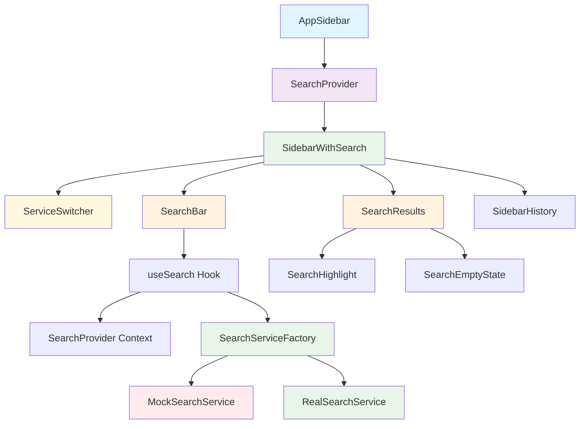
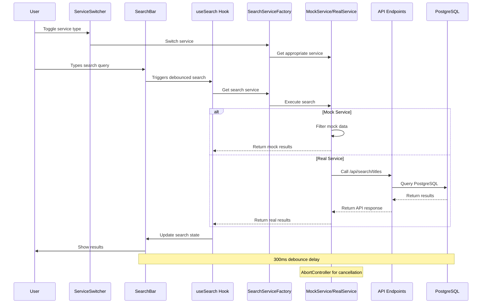
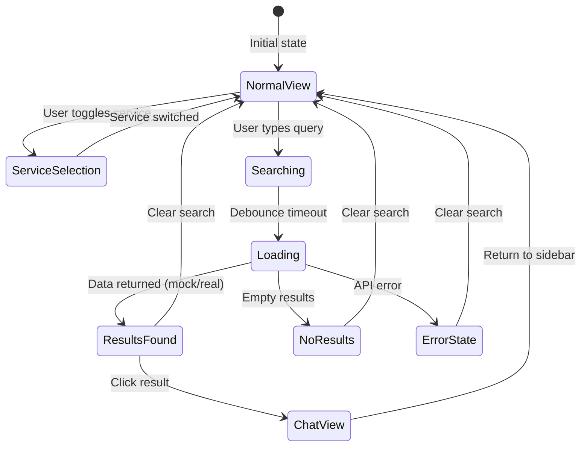
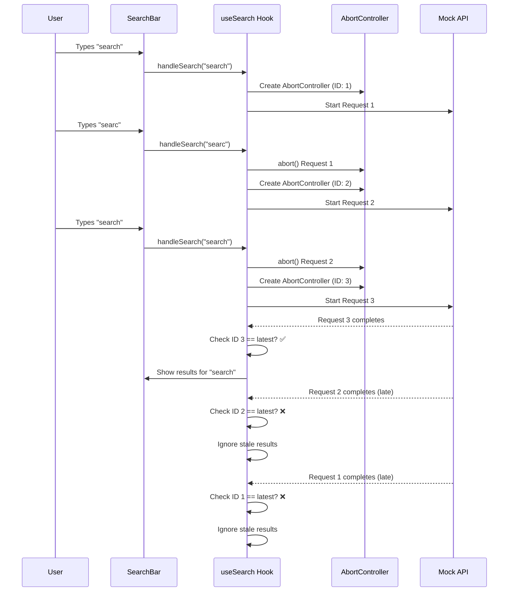
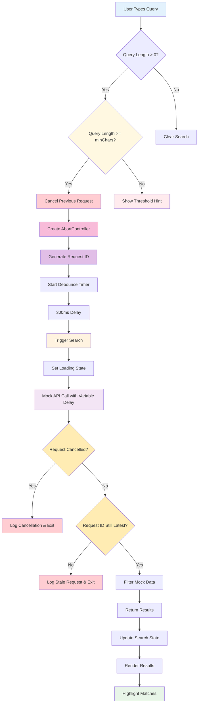

# Chat Search Feature - Implementation Status

## 🎯 Current Implementation Overview

This document describes the **currently implemented** search functionality for the AI chatbot. The search feature allows users to find and filter their chat conversations in real-time, with both mock and real database services available.

## ✅ What's Implemented

### Frontend Components (Complete)
- **SearchBar**: Input field with debounced search and clear functionality
- **SearchResults**: Display filtered chats with highlighted matching text
- **SearchHighlight**: Text highlighting utility for search matches
- **SearchEmptyState**: User-friendly empty state when no results found
- **SearchProvider**: React context for global search state management
- **useSearch**: Custom hook with search logic and service factory
- **SidebarWithSearch**: Integration component that combines search with existing sidebar
- **ServiceSwitcher**: UI component to toggle between mock and real services

### Backend Services (Complete)
- **PostgreSQL Database**: Local and Neon database integration
- **Search API Endpoints**: `/api/search` and `/api/search/titles`
- **Chat API Endpoints**: `/api/chats` and `/api/chats/[id]`
- **Database Migrations**: Full-text search indexes and functions
- **Web Database Viewer**: Custom HTML viewer for inspecting data

### Key Features (Working)
- ✅ Real-time search with 300ms debouncing
- ✅ **Minimum character threshold (2 chars default, configurable)**
- ✅ **Race condition prevention with AbortController**
- ✅ **Request ID tracking to ignore stale responses**
- ✅ **Automatic request cancellation on new input**
- ✅ Text highlighting for search matches
- ✅ Loading states and skeleton animations
- ✅ Empty state with helpful tips
- ✅ **Character threshold hint when query too short**
- ✅ **Full keyboard navigation (↑↓ navigate, Enter select, Home/End jump, Esc clear)**
- ✅ **Visual selection highlighting with blue background**
- ✅ **Auto-scroll to selected item**
- ✅ **Smart focus management (doesn't interfere with typing)**
- ✅ Responsive design for all screen sizes
- ✅ Smooth transitions between search and normal view
- ✅ **Mock and Real service switching**
- ✅ **PostgreSQL full-text search**
- ✅ **Date handling for both Date objects and strings**
- ✅ **Service factory pattern for easy switching**
- ✅ **Database viewer for development**

## 🏗️ Implementation Architecture

### Component Hierarchy


### Data Flow


### State Management Flow


## 🔧 Technical Implementation Details

### SearchBar Component
```typescript
// Key features implemented:
- Debounced input (300ms delay)
- Clear button with X icon
- Loading spinner during search
- Keyboard navigation (Escape key)
- Focus management
- Accessibility support
- **Minimum character threshold (configurable, default: 2)**
- **Character threshold hint display**
```

### SearchResults Component
```typescript
// Key features implemented:
- Highlighted text matching
- Context snippets from messages
- Empty state with helpful tips
- Loading skeleton animation
- Result count display
- Click handling for navigation
```

### SearchProvider Context
```typescript
// State management:
interface SearchState {
  query: string;           // Current search query
  results: Chat[];         // Search results
  isLoading: boolean;      // Loading state
  isSearching: boolean;    // Whether actively searching
}
```

### useSearch Hook
```typescript
// Current implementation:
- Service factory pattern for mock/real switching
- Real API calls to PostgreSQL database
- Variable delay simulation (200-1200ms) for mock testing
- Filtering by title and message content
- Navigation handling
- Search state management
- **Minimum character threshold validation**
- **Configurable threshold (default: 2 characters)**
- **AbortController for request cancellation**
- **Request ID tracking to prevent stale results**
- **Automatic cleanup on component unmount**
- **Date handling for both Date objects and strings**
- **Service logging for debugging**
```

### Service Architecture
```typescript
// Service Factory Pattern:
interface SearchService {
  searchChats(query: string, signal?: AbortSignal): Promise<MockChat[]>;
  getAllChats(): Promise<MockChat[]>;
  getChatById(id: string): Promise<MockChat | null>;
}

// Mock Service: Uses hardcoded data with variable delays
// Real Service: Calls /api/search/titles with AbortController support
// Factory: Dynamically switches between services based on configuration
```

### Date Handling
```typescript
// lib/utils/dateUtils.ts - New utility functions:
- safeParseDate(): Converts strings/Date to Date objects safely
- formatRelativeDate(): Shows "2h ago", "3d ago" format
- formatAbsoluteDate(): Shows full date format
- isValidDate(): Validates date objects

// Handles both:
- Mock data: Date objects
- API data: ISO string dates from PostgreSQL
```

## 📁 File Structure (Implemented)

```
components/
├── search/
│   ├── SearchBar.tsx          ✅ Complete
│   ├── SearchResults.tsx      ✅ Complete
│   ├── SearchEmptyState.tsx   ✅ Complete
│   ├── SearchHighlight.tsx    ✅ Complete
│   ├── SearchRaceConditionTest.tsx ✅ Complete
│   └── ServiceSwitcher.tsx    ✅ Complete (New)
├── providers/
│   └── SearchProvider.tsx     ✅ Complete
├── sidebar-with-search.tsx    ✅ Complete
└── app-sidebar.tsx            ✅ Modified

hooks/
└── useSearch.ts               ✅ Complete

lib/
├── mock/
│   └── searchMockData.ts      ✅ Complete (Mock service + Factory)
├── services/
│   └── searchService.ts       ✅ Complete (Real API service)
├── config/
│   └── searchConfig.ts        ✅ Complete (Service configuration)
└── utils/
    └── dateUtils.ts           ✅ Complete (Date handling utilities)

app/api/
├── search/
│   ├── route.ts               ✅ Complete (General search)
│   └── titles/
│       └── route.ts           ✅ Complete (Title-only search)
├── chats/
│   ├── route.ts               ✅ Complete (All chats)
│   └── [id]/
│       └── route.ts           ✅ Complete (Single chat)
└── db-viewer/
    └── route.ts               ✅ Complete (Database viewer API)

lib/db/
├── migrations/
│   └── 0002_add_search_indexes.sql ✅ Complete (PostgreSQL indexes)
├── queries.ts                 ✅ Complete (Database connection)
└── migrate.ts                 ✅ Complete (Migration runner)

public/
└── db-viewer.html             ✅ Complete (Web database viewer)

scripts/
└── open-db-viewer.sh          ✅ Complete (Viewer helper script)
```

## 🎨 UI/UX Implementation

### Search Bar Design
- **Placement**: Top of sidebar, below header
- **Styling**: Consistent with existing design system
- **Icons**: Search icon (left), clear icon (right)
- **Placeholder**: "Search conversations..."
- **Focus State**: Border highlight on focus

### Search Results Design
- **Layout**: Maintains existing chat item styling
- **Highlighting**: Yellow background for matching text
- **Empty State**: Friendly message with search tips
- **Loading State**: Skeleton loader matching chat structure
- **Context**: Shows message excerpts with highlighted terms

### Responsive Behavior
- **Mobile**: Full-width search bar
- **Desktop**: Compact search bar
- **Tablet**: Adaptive sizing

## 🔍 Current Search Algorithm

### Service Implementation
```typescript
// Mock Service Implementation:
1. **Minimum character validation** (default: 2 chars)
2. **AbortController cancellation** for previous requests
3. **Request ID tracking** to ignore stale responses
4. Filter chats by title (case-insensitive)
5. Filter chats by last message content
6. Return matching results with mock data
7. **Variable delay simulation** (200-1200ms) for race condition testing
8. Highlight matching text in results
9. **Show threshold hint when query too short**
10. **Console logging** for debugging race conditions

// Real Service Implementation:
1. **Minimum character validation** (default: 2 chars)
2. **AbortController cancellation** for previous requests
3. **Request ID tracking** to ignore stale responses
4. **API call to /api/search/titles** with query parameter
5. **PostgreSQL ILIKE search** on chat titles
6. **Relevance scoring** based on match position
7. **Pagination support** (limit/offset)
8. **Error handling** for API failures
9. **Date string handling** for PostgreSQL timestamps
10. **Service logging** for debugging
```

### PostgreSQL Search Features
```sql
-- Full-text search indexes:
- GIN index on chat titles for fast text search
- GIN index on message content for fast text search
- Composite index for chat search with relevance scoring
- Index on message chatId and createdAt for efficient joins

-- Search functions:
- calculate_search_relevance(): Scores matches by position
- extract_message_text(): Extracts text from JSON message parts
- refresh_chat_search_index(): Refreshes materialized view

-- Materialized view:
- chat_search_index: Pre-computed search vectors for optimization
```

### AbortController Implementation Example

**Scenario: User types "search" → "searc" → "search" rapidly**

```typescript
// Layer 1: AbortController Implementation
const abortControllerRef = useRef<AbortController | null>(null);
const requestIdRef = useRef<number>(0);

const performSearch = useCallback(async (query: string) => {
  // Step 1: Cancel previous request if it exists
  if (abortControllerRef.current) {
    abortControllerRef.current.abort(); // Cancels Request 1
  }

  // Step 2: Create new abort controller for this request
  const abortController = new AbortController();
  abortControllerRef.current = abortController;

  // Step 3: Generate unique request ID
  const requestId = ++requestIdRef.current; // Request 2 gets ID: 2

  try {
    // Step 4: Make API call with abort signal
    const response = await fetch(`/api/search?q=${query}`, {
      signal: abortController.signal // Will be cancelled if abort() is called
    });

    // Step 5: Check if request was cancelled
    if (abortController.signal.aborted) {
      console.log(`Request ${requestId} was cancelled`);
      return; // Exit early, don't process results
    }

    // Step 6: Check if this is still the latest request
    if (requestId !== requestIdRef.current) {
      console.log(`Request ${requestId} is stale, ignoring results`);
      return; // Exit early, ignore stale results
    }

    // Step 7: Process and display results
    const data = await response.json();
    setResults(data);
  } catch (error) {
    if (abortController.signal.aborted) {
      console.log(`Request ${requestId} was cancelled`);
      return;
    }
    // Handle other errors...
  }
}, []);
```

**Timeline Example:**
```
Time: 0ms    - User types "search"     → Request 1 (ID: 1) starts
Time: 100ms  - User types "searc"      → Request 1 cancelled, Request 2 (ID: 2) starts  
Time: 200ms  - User types "search"     → Request 2 cancelled, Request 3 (ID: 3) starts
Time: 800ms  - Request 3 completes    → Shows results for "search"
Time: 1200ms - Request 2 completes    → Ignored (stale ID)
Time: 1500ms - Request 1 completes    → Ignored (stale ID)
```

**Console Output:**
```
Request 1 was cancelled for query: "search"
Request 2 was cancelled for query: "searc"  
Request 3 completed successfully for query: "search"
Request 2 is stale, ignoring results for query: "searc"
Request 1 is stale, ignoring results for query: "search"
```

### Race Condition Prevention Flow


### Mock Data Structure
```typescript
interface Chat {
  id: string;
  title: string;
  createdAt: Date;
  visibility: "private" | "public";
  messageCount?: number;
  lastMessage?: string;
  lastMessageAt?: Date;
}
```

## 🚀 How It Works (Current Implementation)

### User Interaction Flow
1. **User types** in search bar
2. **Character threshold check** (minimum 2 chars)
3. **Cancel previous request** (if exists)
4. **Generate unique request ID**
5. **Debounced trigger** (300ms delay)
6. **Mock API call** with variable delay (200-1200ms)
7. **Check request validity** (not cancelled, not stale)
8. **Results display** with highlighted matches
9. **Click result** → Navigate to chat
10. **Clear search** → Return to normal view

### Search Process with Race Condition Prevention


## 🧪 Testing the Implementation

### How to Test
1. **Open the app** at `http://localhost:3000`
2. **Look for Service Switcher** at top of sidebar (Mock/Real toggle)
3. **Look for search bar** below service switcher
4. **Type 1 character** → See threshold hint
5. **Type 2+ characters** → See results with highlighted text
6. **Test service switching**: Toggle between Mock and Real services
7. **Test race conditions**: Type rapidly (e.g., "search" → "searc" → "search")
8. **Check browser console** for request cancellation logs
9. **Click a result** to navigate to chat
10. **Clear search** to return to normal view
11. **Test database viewer**: Visit `http://localhost:3000/db-viewer.html`

### Service Testing
- **Mock Service**: Uses hardcoded data with variable delays
- **Real Service**: Queries PostgreSQL database via API
- **Service Switching**: Toggle button changes service instantly
- **Console Logging**: Shows which service is being used

### Database Testing
- **Database Viewer**: Web interface to inspect PostgreSQL data
- **API Endpoints**: Test `/api/search/titles`, `/api/chats`, etc.
- **Search Queries**: Test with real data from database
- **Date Handling**: Verify dates display correctly from API

### Expected Behavior
- ✅ Service switcher appears at top of sidebar
- ✅ Search bar appears below service switcher
- ✅ **Typing 1 character shows threshold hint**
- ✅ **Typing 2+ characters triggers search after 300ms delay**
- ✅ **Previous requests are cancelled automatically**
- ✅ **Only latest results are displayed**
- ✅ Loading spinner shows during search
- ✅ Results display with highlighted text (mock/real)
- ✅ **Console logs show request cancellation and service type**
- ✅ **Arrow keys (↑↓) navigate through results**
- ✅ **Enter key selects highlighted result**
- ✅ **Home/End keys jump to first/last result**
- ✅ **Escape key clears search**
- ✅ **Visual highlighting of selected item**
- ✅ **Auto-scroll to keep selected item visible**
- ✅ Clicking result navigates to chat
- ✅ Clear button resets search
- ✅ **Service switching works instantly**
- ✅ **Database viewer accessible at /db-viewer.html**

## 🔄 What's Next (Future Enhancements)

### Completed Implementation ✅
- ✅ **Backend API** (`/api/search` and `/api/search/titles` endpoints)
- ✅ **Database indexes** (PostgreSQL full-text search)
- ✅ **Real search queries** (PostgreSQL ILIKE search)
- ✅ **Service architecture** (Mock/Real service switching)
- ✅ **Date handling** (Date objects and string support)
- ✅ **Database viewer** (Web interface for development)

### Future Enhancements
- 🔄 **Search caching** (Redis implementation)
- 🔄 **Semantic search** (OpenAI embeddings)
- 🔄 **Advanced filtering** (date ranges, visibility, etc.)
- 🔄 **Search analytics** (track popular searches)
- 🔄 **Performance optimization** (virtual scrolling for large results)
- 🔄 **Search suggestions** (autocomplete functionality)
- 🔄 **Search history** (recent searches)
- 🔄 **Export functionality** (export search results)

### Integration Points
- Search result caching with Redis
- Semantic search with OpenAI embeddings
- Advanced search filters and sorting
- Search analytics and user behavior tracking

## 📊 Current Performance

### Frontend Performance
- ✅ **Debouncing**: Prevents excessive API calls
- ✅ **Loading States**: Smooth user experience
- ✅ **Memoization**: Efficient re-renders
- ✅ **Responsive**: Works on all devices

### Mock Performance
- **Search Delay**: 300ms debounce + 200-1200ms mock API (variable)
- **Result Rendering**: Instant after data received
- **Navigation**: Immediate on result click
- **State Updates**: Optimized with React context

### Real Service Performance
- **Search Delay**: 300ms debounce + ~50-200ms PostgreSQL query
- **Database Indexes**: GIN indexes for fast full-text search
- **Pagination**: Efficient limit/offset queries
- **Connection Pooling**: Optimized database connections
- **Error Handling**: Graceful fallback on API failures

## 🎯 Success Metrics (Current)

### User Experience
- ✅ **Search Responsiveness**: Smooth typing experience
- ✅ **Visual Feedback**: Clear loading and empty states
- ✅ **Accessibility**: Keyboard navigation support
- ✅ **Mobile Friendly**: Responsive design

### Technical Metrics
- ✅ **Component Reusability**: Modular design
- ✅ **State Management**: Clean context implementation
- ✅ **Type Safety**: Full TypeScript support
- ✅ **Code Quality**: No linting errors
- ✅ **Service Architecture**: Factory pattern for easy switching
- ✅ **Database Integration**: PostgreSQL with optimized indexes
- ✅ **API Design**: RESTful endpoints with proper error handling
- ✅ **Date Handling**: Robust handling of multiple date formats
- ✅ **Error Recovery**: Graceful handling of API failures

---

**Note**: This implementation provides a complete search experience with both mock and real database services. The search feature is fully functional with PostgreSQL integration, service switching, and comprehensive error handling. Future enhancements can include caching, semantic search, and advanced filtering capabilities.
