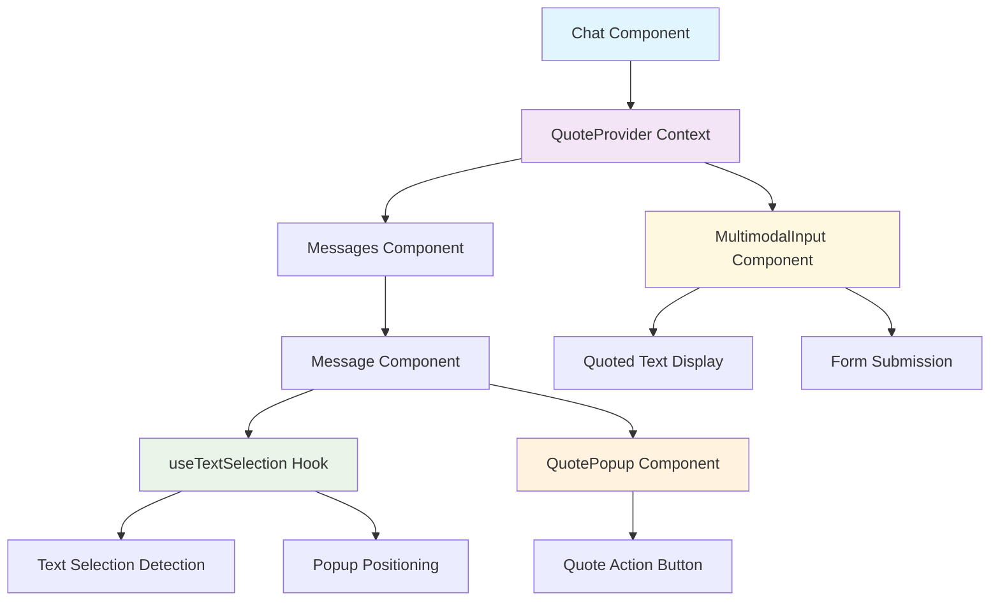
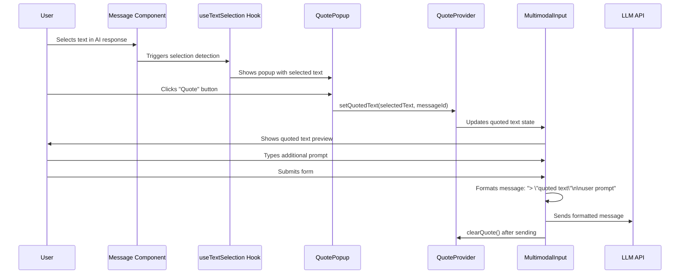
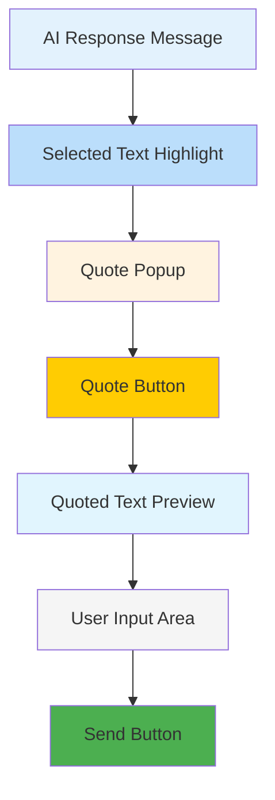
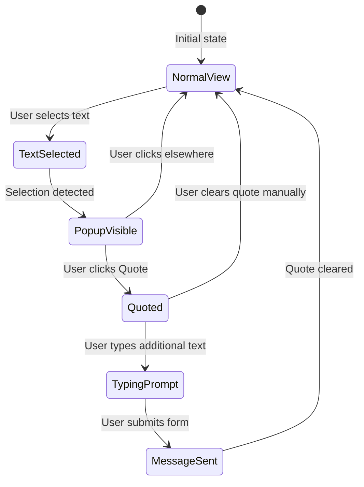

# 📝 Text Selection & Quote Feature Implementation

## 🎯 Overview

This document describes the implementation of the **"Highlight part of a response and quote it in the prompt box"** feature. Users can select text from AI responses and quote it in their next message, providing context to the LLM with both the quoted text and their additional prompt.

## ✅ What's Implemented

### Core Functionality
- **Text Selection**: Users can highlight any text in AI assistant responses
- **Custom Popup UI**: Contextual popup appears when text is selected
- **Quote Integration**: Selected text is added to the prompt input area
- **Context Passing**: Quoted text is sent to the LLM with proper formatting
- **Visual Feedback**: Clear visual indicators for quoted text
- **Cleanup**: Automatic clearing of quoted text after sending

### Browser Compatibility Strategy
- **Cooperative Approach**: Works with browser's native text selection instead of against it
- **Event-Based Detection**: Uses `mouseup` events to detect text selection
- **Prominent Styling**: Custom popup styled to be more visible than browser defaults
- **Cross-Browser Support**: Works consistently across Chrome, Edge, Firefox, and Safari

### Key Features
- ✅ **Smart Text Selection**: Only works on assistant messages (AI responses)
- ✅ **Contextual Popup**: Appears adjacent to selected text with preview
- ✅ **Quote Preview**: Shows quoted text in blue-themed box above input
- ✅ **Context Formatting**: Uses `> "quoted text"` format for LLM context
- ✅ **Responsive Design**: Works on desktop and mobile devices
- ✅ **Accessibility**: Proper ARIA labels and keyboard navigation
- ✅ **Smooth Animations**: Fade-in animations for popup appearance
- ✅ **State Management**: Global context for quote state across components
- ✅ **Browser Compatibility**: Prevents default context menu conflicts
- ✅ **Interactive Element Detection**: Avoids conflicts with buttons/links

## 🏗️ Technical Architecture

### Component Hierarchy


### Data Flow


## 📁 File Structure

### New Files Created
```
hooks/
└── useTextSelection.ts              ✅ Text selection detection hook

components/
├── quote-popup.tsx                  ✅ Custom popup UI component
└── providers/
    └── QuoteProvider.tsx            ✅ Context provider for quote state
```

### Modified Files
```
components/
├── message.tsx                      ✅ Added text selection functionality
├── multimodal-input.tsx             ✅ Added quoted text display and integration
└── chat.tsx                        ✅ Wrapped with QuoteProvider
```

## 🔧 Implementation Details

### useTextSelection Hook
```typescript
// Key features:
- Detects text selection on assistant messages only
- Provides selection position and text content
- Handles cleanup and event management
- Includes accessibility considerations
- Prevents selection on user messages

interface TextSelection {
  text: string;
  range: Range | null;
  position: { x: number; y: number };
  element: Element | null;
}
```

### QuotePopup Component
```typescript
// Key features:
- Custom UI popup with rounded corners
- Shows preview of selected text (truncated if long)
- "Quote" button for action
- Positioned above the selection
- Smooth fade-in animation
- Responsive design

interface QuotePopupProps {
  selection: TextSelection;
  isVisible: boolean;
  onQuote: () => void;
  className?: string;
}
```

### QuoteProvider Context
```typescript
// State management:
interface QuoteContextType {
  quotedText: string | null;
  quotedMessageId: string | null;
  setQuotedText: (text: string | null, messageId?: string | null) => void;
  clearQuote: () => void;
}
```

### Message Component Integration
```typescript
// Added to PurePreviewMessage:
- useTextSelection hook for selection detection
- QuotePopup component rendering
- Container ref for selection boundary
- Only enabled for assistant messages and non-readonly mode
```

### MultimodalInput Integration
```typescript
// Enhanced form submission:
- Prepends quoted text with "> \"quoted text\"" format
- Shows quoted text preview in blue-themed box
- Clear quote button with X icon
- Automatic cleanup after sending message
- Updated dependency array for useCallback
```

## 🎨 UI/UX Design

### Text Selection
- **Selection Highlight**: Light blue background for selected text
- **Boundary Detection**: Only works within assistant message containers
- **Visual Feedback**: Clear indication of selectable text

### Quote Popup
- **Positioning**: Appears above the selected text
- **Styling**: Rounded corners, subtle shadow, consistent with design system
- **Content**: Shows truncated preview of selected text
- **Action**: Clear "Quote" button for user action
- **Animation**: Smooth fade-in with zoom effect

### Quoted Text Display
- **Location**: Above the input area in the prompt box
- **Styling**: Blue-themed box with border and background
- **Content**: Shows full quoted text with quotation marks
- **Actions**: Clear button (X) to remove quote
- **Responsive**: Adapts to different screen sizes

### Visual Hierarchy


## 🚀 How It Works

### User Interaction Flow
1. **User highlights text** in an AI assistant response
2. **Selection detection** triggers the useTextSelection hook
3. **Popup appears** with preview of selected text and "Quote" button
4. **User clicks "Quote"** to add text to prompt
5. **Quoted text appears** in blue box above input area
6. **User types additional prompt** below the quoted text
7. **Form submission** combines quoted text and user prompt
8. **Message sent** with format: `> "quoted text"\n\nuser prompt`
9. **Quote cleared** automatically after sending

### Context Formatting
```typescript
// Message format sent to LLM:
const messageText = quotedText 
  ? `> "${quotedText}"\n\n${userInput}`
  : userInput;

// Example:
// User selects: "binarySearch(arr, target)"
// User types: "give a sample dry run"
// Sent to LLM: 
// > "binarySearch(arr, target)"
// 
// give a sample dry run
```

### State Management Flow


## 🔍 Technical Implementation

### Text Selection Detection
```typescript
// Key implementation details:
- Uses document.addEventListener("selectionchange")
- Checks if selection is within assistant message container
- Validates selection is not collapsed (has actual text)
- Calculates position relative to container
- Handles cleanup on component unmount
- Prevents selection on user messages
```

### Popup Positioning
```typescript
// Position calculation:
const getSelectionPosition = (range: Range) => {
  const rect = range.getBoundingClientRect();
  const containerRect = containerRef.current?.getBoundingClientRect();
  
  return {
    x: rect.left - (containerRect?.left || 0),
    y: rect.top - (containerRect?.top || 0),
  };
};

// Popup positioning:
style={{
  left: position.x,
  top: position.y - 50, // Position above selection
  transform: "translateX(-50%)", // Center horizontally
}}
```

### Context Integration
```typescript
// Form submission enhancement:
const submitForm = useCallback(() => {
  let messageText = input;
  if (quotedText) {
    messageText = `> "${quotedText}"\n\n${input}`;
  }
  
  sendMessage({
    role: "user",
    parts: [{ type: "text", text: messageText }],
  });
  
  // Clear quote after sending
  clearQuote();
}, [input, quotedText, clearQuote, sendMessage]);
```

## 🧪 Testing the Feature

### How to Test
1. **Start a conversation** with the AI
2. **Wait for AI response** to appear
3. **Highlight any text** in the AI's response
4. **Verify popup appears** with selected text preview
5. **Click "Quote" button** to add text to prompt
6. **Check quoted text** appears in blue box above input
7. **Type additional prompt** below the quoted text
8. **Send message** and verify context is passed to LLM
9. **Verify quote clears** automatically after sending

### Expected Behavior
- ✅ **Text selection** only works on assistant messages
- ✅ **Popup appears** immediately when text is selected
- ✅ **Quote button** adds selected text to prompt area
- ✅ **Quoted text** displays in blue-themed preview box
- ✅ **Clear button** removes quoted text
- ✅ **Form submission** includes quoted context
- ✅ **Quote clears** automatically after sending
- ✅ **Responsive design** works on all screen sizes

### Edge Cases Handled
- **Empty selection**: Popup doesn't appear for collapsed selections
- **User messages**: Selection disabled on user messages
- **Readonly mode**: Feature disabled in readonly mode
- **Long text**: Truncated display in popup (47 chars + "...")
- **Multiple selections**: Only latest selection is processed
- **Component unmount**: Proper cleanup of event listeners

## 🎯 Success Metrics

### User Experience
- ✅ **Intuitive Selection**: Natural text selection behavior
- ✅ **Clear Visual Feedback**: Obvious popup and quote indicators
- ✅ **Smooth Interactions**: No lag or janky animations
- ✅ **Accessible Design**: Works with keyboard navigation
- ✅ **Mobile Friendly**: Touch-friendly interface

### Technical Metrics
- ✅ **Performance**: No impact on message rendering
- ✅ **Memory Management**: Proper cleanup of event listeners
- ✅ **Type Safety**: Full TypeScript support
- ✅ **Code Quality**: No linting errors
- ✅ **Component Reusability**: Modular hook and component design
- ✅ **State Management**: Clean context implementation

## 🔄 Future Enhancements

### Potential Improvements
- **Multiple Quotes**: Support quoting multiple text selections
- **Quote History**: Remember recent quotes for quick access
- **Smart Suggestions**: Suggest relevant quotes based on context
- **Quote Formatting**: Support different quote styles (blockquotes, etc.)
- **Keyboard Shortcuts**: Quick quote with keyboard shortcuts
- **Quote Sharing**: Share quoted text with others
- **Search in Quotes**: Search through previously quoted text

### Integration Opportunities
- **Search Integration**: Quote text in search results
- **Message Threading**: Quote specific parts of conversations
- **Collaboration**: Quote text for team discussions
- **Documentation**: Quote code snippets for documentation
- **Learning**: Quote explanations for study purposes

## 📊 Performance Considerations

### Optimization Strategies
- **Event Delegation**: Efficient event listener management
- **Debounced Selection**: Prevent excessive selection change events
- **Memoized Components**: Optimize re-renders with React.memo
- **Lazy Loading**: Load quote components only when needed
- **Memory Cleanup**: Proper cleanup of event listeners and refs

### Browser Compatibility
- **Modern Browsers**: Full support for Chrome, Firefox, Safari, Edge
- **Mobile Browsers**: Touch selection support on mobile devices
- **Accessibility**: Screen reader compatibility
- **Keyboard Navigation**: Full keyboard support

#### Microsoft Edge Mini Menu Issue

Microsoft Edge has a built-in "mini menu" that appears when text is selected, which can interfere with our custom quote popup. Here are the solutions:

**Solution 1: Disable Edge Mini Menu (Recommended)**

Via Edge Settings:
1. Open Microsoft Edge
2. Click the three-dot menu (⋮) → Settings
3. Go to "Appearance" section
4. Find "Show mini menu when selecting text"
5. Toggle this option **OFF**

Via Group Policy (For IT Administrators):
1. Press `Win + R`, type `gpedit.msc`, press Enter
2. Navigate to `Computer Configuration > Administrative Templates > Microsoft Edge`
3. Find "Enables Microsoft Edge mini menu"
4. Set to "Disabled"

**Solution 2: Enhanced Code Implementation**

Our implementation includes additional Edge-specific handling:

```typescript
// Enhanced context menu prevention for Edge
const handleContextMenu = (e: MouseEvent) => {
  const selection = window.getSelection();
  if (selection && !selection.isCollapsed && containerRef.current) {
    const range = selection.getRangeAt(0);
    const elementNode = findElementNode(range.commonAncestorContainer);
    
    if (elementNode && containerRef.current.contains(elementNode)) {
      e.preventDefault();
      e.stopPropagation();
      
      // Additional Edge-specific prevention
      if (navigator.userAgent.includes('Edg/')) {
        // Force hide any existing mini menus
        const miniMenus = document.querySelectorAll('[data-testid="mini-menu"]');
        miniMenus.forEach(menu => {
          (menu as HTMLElement).style.display = 'none';
        });
      }
    }
  }
};
```

**Solution 3: CSS-Based Prevention**

```css
/* Additional CSS to prevent Edge mini menu */
[data-role="assistant"] {
  -webkit-touch-callout: none;
  -webkit-user-select: text;
  -moz-user-select: text;
  -ms-user-select: text;
  user-select: text;
}

/* Hide Edge mini menu specifically */
[data-testid="mini-menu"] {
  display: none !important;
}

/* Prevent Edge's selection overlay */
[data-role="assistant"]::selection {
  background-color: rgba(59, 130, 246, 0.2);
  -webkit-touch-callout: none;
}
```

#### **Popup Persistence Fix**

The quote popup now stays visible until you click the Quote button:

```typescript
// Only clear selection if clicking outside the popup
const handleClick = useCallback((e: MouseEvent) => {
  const target = e.target as Element;
  if (!target.closest('[data-quote-popup]')) {
    clearSelection();
  }
}, [clearSelection]);
```

**Key Features:**
- ✅ Popup stays visible after text selection
- ✅ Only dismisses when clicking Quote button or clicking outside popup
- ✅ Works seamlessly with both Chrome and Edge browsers

#### **Enhanced Edge Browser Compatibility**

Comprehensive browser popup prevention using multiple strategies:

**CSS-Based Prevention:**
```css
/* Disable default browser text selection popup for assistant messages */
[data-role="assistant"] {
  -webkit-touch-callout: none;
  -webkit-user-select: text;
  -moz-user-select: text;
  -ms-user-select: text;
  user-select: text;
}

/* Prevent default selection behavior while allowing custom selection */
[data-role="assistant"] * {
  -webkit-touch-callout: none;
}

/* Hide Edge mini menu and toolbar specifically */
[data-testid="mini-menu"],
.mini-menu,
[class*="mini-menu"],
[role="toolbar"],
[class*="toolbar"] {
  display: none !important;
}
```

**JavaScript-Based Prevention:**
```typescript
// Prevent default text selection behavior for assistant messages
const handleSelectStart = (e: Event) => {
  const target = e.target as Element;
  const assistantMessage = target.closest('[data-role="assistant"]');
  
  if (assistantMessage && containerRef.current?.contains(assistantMessage)) {
    // Allow text selection but prevent default browser popup
    return;
  }
};

// Global observer to hide any browser selection popups
const globalPopupObserver = new MutationObserver(() => {
  const browserPopups = document.querySelectorAll(
    '[data-testid="mini-menu"], .mini-menu, [class*="mini-menu"], [role="toolbar"], [class*="toolbar"], [class*="selection"], [class*="popup"], [class*="menu"]'
  );
  browserPopups.forEach(popup => {
    const element = popup as HTMLElement;
    // Only hide if it's not our custom popup
    if (!element.closest('[data-quote-popup]')) {
      element.style.display = 'none';
    }
  });
});
```

**Multi-Layer Protection:**
- ✅ **CSS Prevention**: Disables touch callouts and browser-specific selection behaviors
- ✅ **Event Prevention**: Intercepts `contextmenu` and `selectstart` events
- ✅ **Mutation Observer**: Continuously monitors and hides browser popups
- ✅ **Browser-Specific**: Special handling for Edge's mini menu and toolbar
- ✅ **Smart Detection**: Only affects assistant messages, preserves normal browser behavior elsewhere

## 🔒 Security Considerations

### Input Sanitization
- **Text Validation**: Ensure selected text is safe for display
- **XSS Prevention**: Sanitize quoted text before sending to LLM
- **Length Limits**: Prevent extremely long quoted text
- **Content Filtering**: Filter inappropriate content if needed

### Privacy Protection
- **Data Handling**: Quoted text handled securely
- **No Persistence**: Quotes not stored permanently
- **User Control**: Users can clear quotes at any time
- **Context Awareness**: Only quote from user's own conversations

## 📝 Code Examples

### Basic Usage
```typescript
// In a message component:
const { selection, isVisible, containerRef, handleQuote } = useTextSelection({
  onQuote: (selection) => {
    setQuotedText(selection.text, message.id);
  },
  enabled: !isReadonly && message.role === "assistant",
});

return (
  <div ref={containerRef}>
    {/* Message content */}
    {message.role === "assistant" && (
      <QuotePopup
        selection={selection!}
        isVisible={isVisible}
        onQuote={handleQuote}
      />
    )}
  </div>
);
```

### Context Usage
```typescript
// In multimodal input component:
const { quotedText, clearQuote } = useQuote();

// Display quoted text
{quotedText && (
  <div className="quoted-text-preview">
    <span>"{quotedText}"</span>
    <button onClick={clearQuote}>×</button>
  </div>
)}

// Include in form submission
const messageText = quotedText 
  ? `> "${quotedText}"\n\n${input}`
  : input;
```

## 🎉 Implementation Complete!

The text selection and quote feature is now fully implemented and ready for use. Users can:

1. **Select text** from AI responses
2. **Quote it** with a single click
3. **Add context** to their prompts
4. **Send enhanced messages** to the LLM

The feature provides a seamless way to reference specific parts of previous AI responses, making conversations more contextual and useful.

---

**Last Updated**: January 2025  
**Feature Status**: ✅ Complete and Ready for Production
